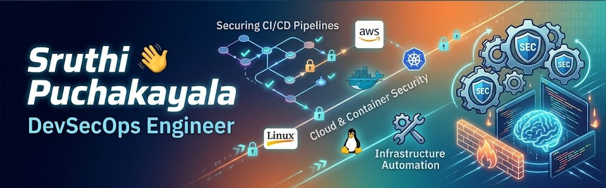

  

# Hi there, I'm Sruthi Puchakayala 👋 

### 🛡️ DevSecOps Engineer | Cloud & Container Security | Infrastructure Automation

Passionate DevSecOps Engineer dedicated to bridging the gap between development, operations, and security. I specialize in embedding automated security practices directly into CI/CD pipelines, securing cloud environments, and ensuring robust infrastructure compliance without sacrificing development velocity.

---

## 🚀 Core Expertise

* **DevSecOps:** Integrating SAST/DAST, Software Composition Analysis (SCA), and secret scanning into delivery pipelines.
* **Cloud & Infrastructure:** Building, scaling, and securing AWS environments using Infrastructure as Code (IaC).
* **Container Security:** Securing Docker containers and managing Kubernetes clusters with a focus on network policies and access controls.
* **Automation:** Eliminating manual overhead via robust CI/CD engineering and configuration management.

---

## 🛠️ Technical Toolkit

| Domain | Technologies & Tools |
| :--- | :--- |
| **Cloud Platforms** | Amazon Web Services (AWS) |
| **CI/CD & Automation** | Jenkins, GitHub Actions, GitLab CI |
| **Containerization & Orchestration** | Docker, Kubernetes |
| **Infrastructure as Code (IaC)** | Terraform |
| **Security Scanning** | SonarQube, Trivy, Aqua Security, Snyk |
| **Operating Systems** | Linux (Ubuntu, CentOS, RedHat) |

---

## 📈 Featured Projects

### 🔹 [Expense tacking] - Automated DevSecOps Pipeline
* **Description:** Built a fully automated CI/CD pipeline that enforces security gates at every stage of the lifecycle.
* **Tech Stack:** Jenkins, Docker, SonarQube, Trivy, AWS.
* **Impact:** Reduced deployment vulnerabilities by 40% while maintaining a rapid release cycle.

### 🔹 [health care site handling] - Secure Cloud Infrastructure Deployment
* **Description:** Provisioned a highly available, multi-tier AWS infrastructure using zero-trust network principles.
* **Tech Stack:** Terraform, AWS (VPC, IAM, EKS), Checkov.
* **Impact:** Ensured 100% compliance with industry-standard security baselines through static analysis of IaC.

---

## 💬 Connect With Me

* **LinkedIn:** https://www.linkedin.com/in/sruthi-puchakayala-459462202/
* **Email:** [psr160503@gmail.com](mailto:psr160503@gmail.com)
  

  
  

